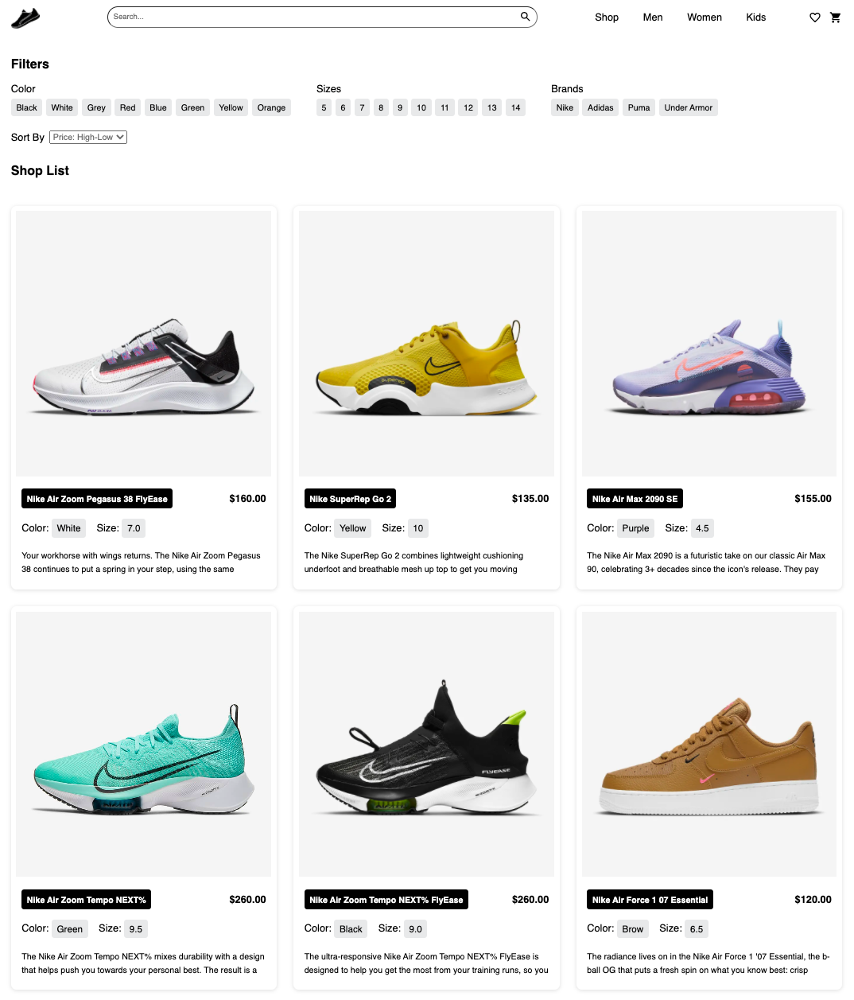
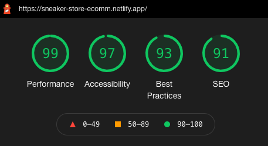

# Sneaker Store 

A web store application built using React JS.

## Status

### Deployment
[](https://app.netlify.com/sites/sneaker-store-ecomm/deploys)

## Demo



### Lighthouse




## Testing

1. Install the project dependencies
   ```shell
   npm install
   ```

2. Run the application
   ```shell
   npm run start
   ```